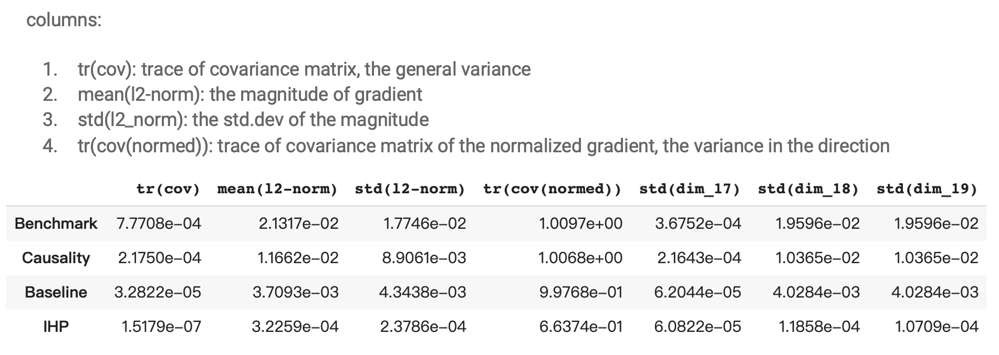

# Bias and Variance Reduction in Off-policy Reinforcement Learning
Project 14, Columbia IEOR 2020 Summer Research Initiative

Supervisor: Dr.Henry Lam (Columbia IEOR Dept.)

Team Member: Yihao Li(yl4326@columbia.edu)
             Jierong Luo(jl5502@columbia.edu)
             
A new policy gradient estimation method inspired by Liu, et al.'s idea in 2018[1]. Focused on the (state, action, next state) triple's distribution in the trajectory rather than the trajectory itself. The new estimate's variance will not be affected by the time horizon in theory.(Most of the existed estimation process will suffer an exponential variance w.r.t. the time horizon)

In the experiment with RiverSwim problem, implemented the IHP(infinite horizon paper) method in two models, with roll-out time horizon = 15000:
The parametric model controlled the bias in 10e2 order, the variance in 10e4 order.

Neural Network Model controlled the direction variance(measured by the trace of the covariance matrix of the normalized gradients) by 0.3 (IHP 0.6 vs Baseline 0.9 to 1.0).

The off-policy optimization learning curve showed that IHP method has a significant advantage compared with all the benchmarks.

[1] Liu, Q., Li, L., Tang, Z., & Zhou, D. (2018). Breaking the curse of horizon: Infinite-horizon off-policy estimation. In Advances in Neural Information Processing Systems (pp. 5356-5366). https://arxiv.org/pdf/1810.12429.pdf 
